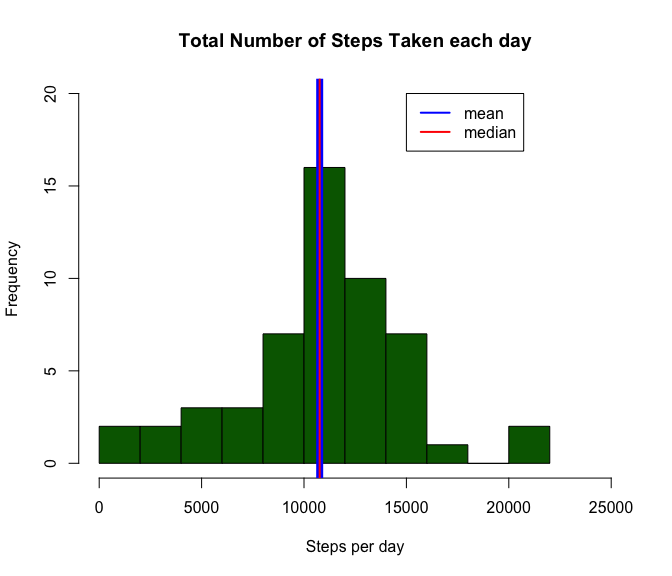
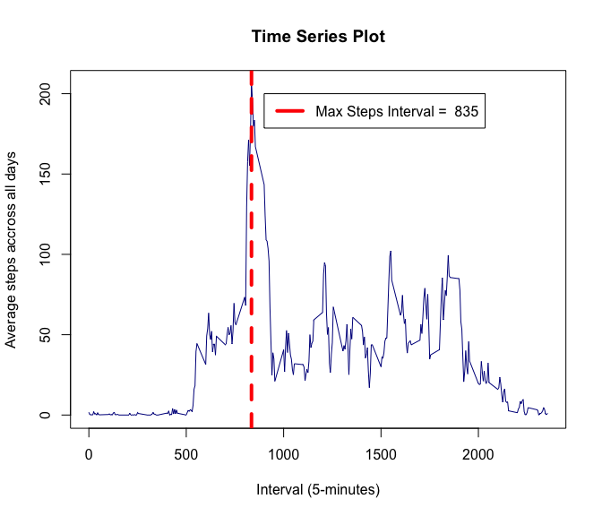
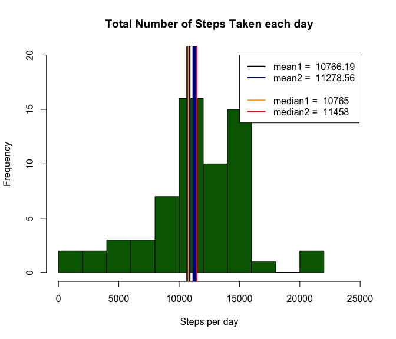
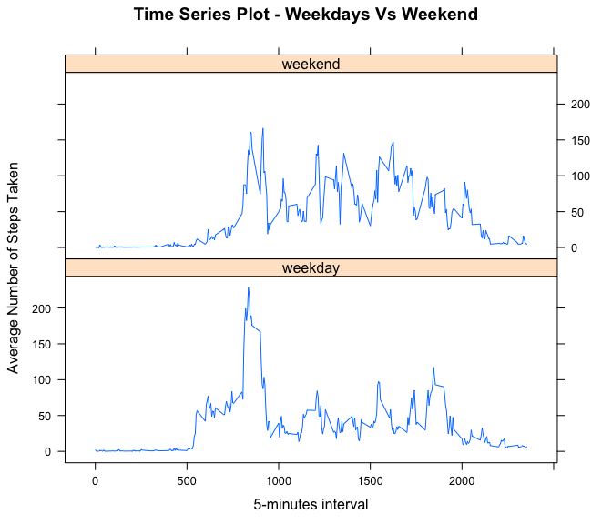

# Reproducible Research: Peer Assessment 1
Oscar Reyes  
April 10, 2015  

#Introduction 
***
It is now possible to collect a large amount of data about personal movement using activity monitoring devices such as a [Fitbit], [Nike Fuelband], or [Jawbone Up]. These type of devices are part of the "quantified self" movement -- a group of enthusiasts who take measurements about themselves regularly to improve their health, to find patterns in their behavior, or because they are tech geeks. But these data remain under-utilized both because the raw data are hard to obtain and there is a lack of statistical methods and software for processing and interpreting the data.

This assignment makes use of data from a personal activity monitoring device. This device collects data at 5 minute intervals through out the day. The data consists of two months of data from an anonymous individual collected during the months of October and November, 2012 and include the number of steps taken in 5 minute intervals each day.

#Data 
***
The data for this assignment can be downloaded from the course web site:  
- **Dataset**: [Activity monitoring data]:[52K] 

The variables included in this dataset are:  
- **steps**: Number of steps taking in a 5-minute interval (missing values are coded as <code class = "data">NA</code>).  
- **date**: The date on which the measurement was taken in YYYY-MM-DD format.  
- **interval**: Identifier for the 5-minute interval in which measurement was taken.  

The dataset is stored in a comma-separated-value (CSV) file and there are a total of 17,568 observations in this dataset.

#Assignment
***
This assignment will be described in multiple parts. You will need to write a report that answers the questions detailed below. Ultimately, you will need to complete the entire assignment in a **single R markdown** document that can be processed by **knitr** and be transformed into an HTML file.

Throughout your report make sure you always include the code that you used to generate the output you present. When writing code chunks in the R markdown document, always use <code class = "data">echo = TRUE</code> so that someone else will be able to read the code. **This assignment will be evaluated via peer assessment so it is essential that your peer evaluators be able to review the code for your analysis**.

For the plotting aspects of this assignment, feel free to use any plotting system in R (i.e., base, lattice,z ggplot2)


Fork/clone the [GitHub repository created for this assignment]. You will submit this assignment by pushing your completed files into your forked repository on GitHub. The assignment submission will consist of the URL to your GitHub repository and the SHA-1 commit ID for your repository state.


> **NOTE**: The GitHub repository also contains the dataset for the assignment so you do not have to download the data separately.

##Loading and preprocessing the data
***
Show any code that is needed to:     

<p class = "question"> 
**1.** Load the data (i.e. <code class = "data">read.csv()</code>).
</p>     

<p class = "answer">    
Answer: 
</p>    
       
<p class = "info">     
The <code class = "data data1">setwd()</code> command is used to setting the working directory (in this case is <code class = "data data1">activity</code>), additionally, other folders are created:    
 - **Raw Data**: contains the dataset (<code class = "data data1">activity.csv</code>).    
 - **css**: contains all css files (<code class = "data data1">styles.css</code>).    
 - **img**: contains all images.   
 <code class = "data data1">colClasses</code>: has been used to declare the format of each variable.     
</p>        
     
  


```r
# Libraries
library (ggplot2)
library (graphics)
library (knitr)
library (lattice)
library (reshape2)

main_dir <- "~"
main_folder <- "activity"
folder <- "Raw Data"
img <- "img"
img_path <- "~/activity/img"
activity_zip <- "activity.zip"
activity_csv <- "activity.csv"
file_url <- "http://d396qusza40orc.cloudfront.net/repdata/data/activity.zip"

setwd (main_dir)
setwd (main_folder)
setwd (folder)
## Load the info into a data.frame (info_activity)
info_activity <- read.csv (activity_csv, 
                           header = TRUE, 
                           colClasses = c ("numeric", 
                                           "Date", 
                                           "numeric"))
setwd (main_dir)
setwd (main_folder)
```

<p class = "question">
**2.** Process/transform the data (if necessary) into a format suitable for your analysis.
</p>    
      
<p class = "answer">    
Answer: 
</p>    
       
<p class = "info">     
<code class = "data data1">colClasses</code>: has been used to declare the format of each variable:    
- ***steps*** as <code class = "data data1">numeric</code>.   
- ***date*** as <code class = "data data1">Date</code>.    
- ***interval*** as <code class = "data data1">numeric</code>.
</p>        
      

```r
### head (info_activity)
head (info_activity)
```

```
##   steps       date interval
## 1    NA 2012-10-01        0
## 2    NA 2012-10-01        5
## 3    NA 2012-10-01       10
## 4    NA 2012-10-01       15
## 5    NA 2012-10-01       20
## 6    NA 2012-10-01       25
```

```r
### Structure of data.frame (info_activity) --> str (info_activity)
str (info_activity)
```

```
## 'data.frame':	17568 obs. of  3 variables:
##  $ steps   : num  NA NA NA NA NA NA NA NA NA NA ...
##  $ date    : Date, format: "2012-10-01" "2012-10-01" ...
##  $ interval: num  0 5 10 15 20 25 30 35 40 45 ...
```

```r
### Summary of data.frame (info_activity) --> summary (info_activity)
summary (info_activity)
```

```
##      steps             date               interval     
##  Min.   :  0.00   Min.   :2012-10-01   Min.   :   0.0  
##  1st Qu.:  0.00   1st Qu.:2012-10-16   1st Qu.: 588.8  
##  Median :  0.00   Median :2012-10-31   Median :1177.5  
##  Mean   : 37.38   Mean   :2012-10-31   Mean   :1177.5  
##  3rd Qu.: 12.00   3rd Qu.:2012-11-15   3rd Qu.:1766.2  
##  Max.   :806.00   Max.   :2012-11-30   Max.   :2355.0  
##  NA's   :2304
```

##What is mean total number of steps taken per day?
***
For this part of the assignment, you can ignore the missing values in the dataset.    
      
<p class = "question"> 
**1.** Make a histogram of the total number of steps taken each day.
</p>     

<p class = "answer"> 
Answer: 
</p>    

<p class = "info">     
Using the function <code class = "data data1">aggregate</code> all <code class = "data data1"> NA </code>'s are ignored and a new subset is created, computting summary statistics for each with function <code class = "data data1">sum</code> per <code class = "data data1">date</code>.
</p>


```r
## Calculate the total number of steps taken per day
steps_per_day <- aggregate (steps ~ date,
                            data = info_activity,
                            FUN = sum,
                            na.rm = TRUE)
steps_per_day
```

```
##          date steps
## 1  2012-10-02   126
## 2  2012-10-03 11352
## 3  2012-10-04 12116
## 4  2012-10-05 13294
## 5  2012-10-06 15420
## 6  2012-10-07 11015
## 7  2012-10-09 12811
## 8  2012-10-10  9900
## 9  2012-10-11 10304
## 10 2012-10-12 17382
## 11 2012-10-13 12426
## 12 2012-10-14 15098
## 13 2012-10-15 10139
## 14 2012-10-16 15084
## 15 2012-10-17 13452
## 16 2012-10-18 10056
## 17 2012-10-19 11829
## 18 2012-10-20 10395
## 19 2012-10-21  8821
## 20 2012-10-22 13460
## 21 2012-10-23  8918
## 22 2012-10-24  8355
## 23 2012-10-25  2492
## 24 2012-10-26  6778
## 25 2012-10-27 10119
## 26 2012-10-28 11458
## 27 2012-10-29  5018
## 28 2012-10-30  9819
## 29 2012-10-31 15414
## 30 2012-11-02 10600
## 31 2012-11-03 10571
## 32 2012-11-05 10439
## 33 2012-11-06  8334
## 34 2012-11-07 12883
## 35 2012-11-08  3219
## 36 2012-11-11 12608
## 37 2012-11-12 10765
## 38 2012-11-13  7336
## 39 2012-11-15    41
## 40 2012-11-16  5441
## 41 2012-11-17 14339
## 42 2012-11-18 15110
## 43 2012-11-19  8841
## 44 2012-11-20  4472
## 45 2012-11-21 12787
## 46 2012-11-22 20427
## 47 2012-11-23 21194
## 48 2012-11-24 14478
## 49 2012-11-25 11834
## 50 2012-11-26 11162
## 51 2012-11-27 13646
## 52 2012-11-28 10183
## 53 2012-11-29  7047
```

```r
## Calculate and report the mean and median total number of steps taken per day
mean_steps <- mean (steps_per_day$steps)
median_steps <- median (steps_per_day$steps)

hist (steps_per_day$steps,
      breaks = 10,
      col = "darkgreen",
      main = "Total Number of Steps Taken each day",
      xlim = c (0,
                25000),
      ylim = c (0 ,
                20),
      xlab = "Steps per day",
      ylab = "Frequency"
      )

abline (v = mean_steps,
       col = "blue",
       lwd = 7
       )

abline (v = median_steps,
        col = "red",
        lty = 1,
        lwd = 2
        )

legend (15000,
        20,
        c ( "mean",
            "median"),
        col = c("blue",
                "red"),
        lty = 1,
        lwd = 2
        )
```

 
      
<p class = "question"> 
**2.** Calculate and report the mean and median total number of steps taken per day.
</p>    

<p class = "answer"> 
Answer: 
</p>    

<p class = "info">     
Functions <code class = "data data1">mean</code> and <code class = "data data1">median</code> are used to calculate  the required values.
</p>
     
<table class = "tg">   
<thead>
<tr><th class="tg-031e">**Data**</th><th class="tg-031e">**Value**</th></tr>
</thead>   
<tbody>
<tr><td class="tg-031e"><code class = "data">mean</code></td><td class="tg-031e"><code class = "data">10766.19</code></td></tr>   
<tr><td class="tg-031e"><code class = "data">media</code></td><td class="tg-031e"><code class = "data">11458</code></td></tr>
</tbody>    
</table>      
    

```r
summary (steps_per_day)
```

```
##       date                steps      
##  Min.   :2012-10-02   Min.   :   41  
##  1st Qu.:2012-10-16   1st Qu.: 8841  
##  Median :2012-10-29   Median :10765  
##  Mean   :2012-10-30   Mean   :10766  
##  3rd Qu.:2012-11-16   3rd Qu.:13294  
##  Max.   :2012-11-29   Max.   :21194
```

```r
# Mean
mean_steps
```

```
## [1] 10766.19
```

```r
# Median
median_steps
```

```
## [1] 10765
```


##What is the average daily activity pattern?
***    
<p class = "question"> 
**1.** Make a time series plot (i.e. <code class = "data">type = "l"</code>) of the 5-minute interval (x-axis) and the average number of steps taken, averaged across all days (y-axis).
</p>  

<p class = "answer"> 
Answer: 
</p>   

<p class = "info">     
In order to calculate the '<code class = "data data1">mean</code>' of the steps by <code class = "data data1">interval</code>, the function '<code class = "data data1">complete.cases</code>' is used, to obtaing all no missing values.
The function '<code class = "data data1">tapply</code>' is used, and it contains and uses:      
- The function '<code class = "data data1">mean</code>'.    
- As index the '<code class = "data data1">interval</code>' variable of the '<code class = "data data1">info_activity</code>' dataset, which contains all initial dataset information.
And a new column, called '<code class = "data data1">average steps</code>', is added to the dataset, in order to contain all results.  **This column has the same name of the new dataset**, used to plot all.
</p>    
    

```r
info_activity_noNA <- info_activity[complete.cases(info_activity),]
average_steps <- as.data.frame (tapply (info_activity_noNA$steps,
                                        INDEX = info_activity_noNA$interval,
                                        FUN = "mean",
                                        na.rm = TRUE)
)

colnames (average_steps) <- "average_steps"
average_steps$interval <- rownames (average_steps)
row.names (average_steps) <- NULL

head (average_steps)
```

```
##   average_steps interval
## 1     1.7169811        0
## 2     0.3396226        5
## 3     0.1320755       10
## 4     0.1509434       15
## 5     0.0754717       20
## 6     2.0943396       25
```

```r
### Time series plot
plot (average_steps$interval,
      average_steps$average_steps,
      type = "l",
      col = "darkblue",
      main = "Time Series Plot",
      xlab = "Interval (5-minutes)",
      ylab = "Average steps accross all days"
      )

## Which 5-minute interval, on average across all the days in the dataset,
## contains the maximum number of steps?
max_steps <- which.max (average_steps$average_steps)# == average_steps$average_steps
which_max_steps <- as.integer (average_steps[max_steps,"interval"])

abline (v = which_max_steps,
        col = "red",
        lty = 2,
        lwd = 4
        )

legend (900,
        200,
        legend = paste ("Max Steps Interval = ", which_max_steps),
        col = c ("red"),
        lty = 1,
        lwd = 4
        )
```

 
       
           
<p class = "question"> 
**2.** Which 5-minute interval, on average across all the days in the dataset, contains the maximum number of steps?
</p>    

<p class = "answer"> 
Answer: 
</p>    

<p class = "info">     
The ***interval '<code class = "data data1">835</code>'*** contains the maximum number of steps, as is shown in the graphic.  And the result is contained in the '<code class = "data data1">which_max_steps</code>' variable.
As is shown in the '<code class = "data data1">summary</code>' the maximum average of steps is '<code class = "data data1"> 206.170</code>', after and before (500 value) the trend is regular, except at the beginning (0 - 500) and at the end (2000 tot the end).
</p>


```r
which_max_steps
```

```
## [1] 835
```

```r
summary (average_steps)
```

```
##  average_steps       interval        
##  Min.   :  0.000   Length:288        
##  1st Qu.:  2.486   Class :character  
##  Median : 34.113   Mode  :character  
##  Mean   : 37.383                     
##  3rd Qu.: 52.835                     
##  Max.   :206.170
```

###Imputing missing values
***
Note that there are a number of days/intervals where there are missing values (coded as <code class = "data">NA</code>). The presence of missing days may introduce bias into some calculations or summaries of the data.       
       
<p class = "question"> 
**1.** Calculate and report the total number of missing values in the dataset (i.e. the total number of rows with <code class = "data">NAs</code>).
</p>    

<p class = "answer"> 
Answer: 
</p>    

<p class = "info">     
The total number of missing values in the dataset are '<code class = "data data1">2304</code>'.
</p>


```r
total_NAs <- sum (is.na (info_activity))

total_NAs
```

```
## [1] 2304
```
       
<p class = "question"> 
**2.** Devise a strategy for filling in all of the missing values in the dataset. The strategy does not need to be sophisticated. For example, you could use the mean/median for that day, or the mean for that 5-minute interval, etc.
</p>   

<p class = "answer"> 
Answer: 
</p>

<p class = "info">     
The strategy for filling in all missing values in the dataset is to use the '<code class = "data">5-minutes mean</code>'.
</p>

<p class = "question"> 
**3.** Create a new dataset that is equal to the original dataset but with the missing data filled in.
</p>   

<p class = "answer"> 
Answer: 
</p>    
<p class = "info"> The new dataset is called '<code class = "data">average_steps_mean</code>'.    
The '<code class = "data">dcast</code>' function is used to fill with '<code class = "data">0</code>' all missing values of the '<code class = "data">info_activity</code>' dataset, and the result is stored in '<code class = "data">info_activity_steps</code>' dataset.     
The '<code class = "data">dcast</code>' function is used, again, to fill all 'missing values' contained in the '<code class = "data">info_activity</code>' dataframe with the '<code class = "data">rowMeans</code>' function result, having as main dataset the '<code class = "data">info_activity</code>' dataset and as parameter the '<code class = "data">info_activity_steps</code>' dataframe, this last dataset does not contains 'missing values', so it can be used to calculate the '<code class = "data">mean</code>'.     
The variable '<code class = "data">date</code>' is converted to '<code class = "data">Date</code>'.
The '<code class = "data">info_activity_steps</code>' dataframe is reshaped and the result is stored in the '<code class = "data">average_steps_mean</code>' data.frame.
</p>


```r
## Create a new dataset that is equal to the original dataset
##  but with the missing data filled in.
info_activity_steps <- dcast (info_activity,
                              interval ~ date,
                              fill = 0,
                              value.var = "steps"
)
info_activity_steps_full <- dcast (info_activity,
                                   interval ~ date,
                                   fill = rowMeans (info_activity_steps, na.rm = TRUE),
                                   value.var = "steps"
)
average_steps_mean <- as.data.frame(reshape (info_activity_steps_full,
                                             varying = list ( names (info_activity_steps_full [2:length (names (info_activity_steps_full))])),
                                             v.names = c ("steps"),
                                             timevar = "date",
                                             idvar = c ("interval"),
                                             times = names (info_activity_steps_full) [2:length (names (info_activity_steps_full))],
                                             direction = "long",
                                             new.row.names = 1:dim(info_activity)[1]
))

average_steps_mean$date <- as.Date (average_steps_mean$date, "%Y-%m-%d")

## Make a histogram of the total number of steps taken each day and Calculate and report
##  the mean and median total number of steps taken per day.
## Do these values differ from the estimates from the first part of the assignment?
## What is the impact of imputing missing data on the estimates of the total daily number of steps?
steps_per_day_mean <- aggregate (steps ~ date,
                                 FUN = sum,
                                 data = average_steps_mean,
                                 na.rm = TRUE
)

summary (average_steps_mean)
```

```
##     interval           date                steps       
##  Min.   :   0.0   Min.   :2012-10-01   Min.   :  0.00  
##  1st Qu.: 588.8   1st Qu.:2012-10-16   1st Qu.:  0.00  
##  Median :1177.5   Median :2012-10-31   Median :  0.00  
##  Mean   :1177.5   Mean   :2012-10-31   Mean   : 39.16  
##  3rd Qu.:1766.2   3rd Qu.:2012-11-15   3rd Qu.: 37.00  
##  Max.   :2355.0   Max.   :2012-11-30   Max.   :806.00
```

```r
head (average_steps_mean)
```

```
##   interval       date     steps
## 1        0 2012-10-01 1.4677419
## 2        5 2012-10-01 0.3709677
## 3       10 2012-10-01 0.2741935
## 4       15 2012-10-01 0.3709677
## 5       20 2012-10-01 0.3870968
## 6       25 2012-10-01 2.1935484
```

<p class = "question"> 
**4.** Make a histogram of the total number of steps taken each day and Calculate and report the **mean** and **median** total number of steps taken per day. Do these values differ from the estimates from the first part of the assignment? What is the impact of imputing missing data on the estimates of the total daily number of steps?
</p>    

<p class = "answer"> 
Answer: 
</p>      
    
<p class = "info">Yes, values differ from the estimates from the first part, as is shown in the graphic.
</p>

<table class = "tg">   
<thead>
<tr><th class="tg-031e">**Data**</th><th class="tg-031e">**Value**</th></tr>
</thead>   
<tbody>
<tr><td class="tg-031e"><code class = "data">mean1</code></td><td class="tg-031e"><code class = "data">10766.19</code></td></tr>   
<tr><td class="tg-031e"><code class = "data">mean2</code></td><td class="tg-031e"><code class = "data">11278.56</code></td></tr>
<tr><td></td><td></td></tr>
<tr><td class="tg-031e"><code class = "data">median1</code></td><td class="tg-031e"><code class = "data">10765.19</code></td></tr>   
<tr><td class="tg-031e"><code class = "data">median2</code></td><td class="tg-031e"><code class = "data">11458</code></td></tr>
</tbody>    
</table>    


```r
## Create a new factor variable in the dataset with two levels – “weekday” and “weekend”
##   indicating whether a given date is a weekday or weekend day.
steps_per_day_mean <- aggregate (steps ~ date,
                                 FUN = sum,
                                 data = average_steps_mean,
                                 na.rm = TRUE
)

mean_steps_per_day_mean <- mean (steps_per_day_mean$steps)
median_steps_per_day_mean <- median (steps_per_day_mean$steps)

size_frame <- nrow (average_steps_mean)
for (i in 1:size_frame) {
        if (weekdays (average_steps_mean$date[i]) %in% c ("Saturday", "Sunday")) {
                average_steps_mean$day_type[i] <- "weekend"
        }
        else {
                average_steps_mean$day_type[i] <- "weekday"
        }
}
##  Make a panel plot containing a time series plot (i.e. type = "l")
##   of the 5-minute interval (x-axis) and the average number of steps taken,
##   averaged across all weekday days or weekend days (y-axis).
## See the README file in the GitHub repository to see an example
##   of what this plot should look like using simulated data.

steps_time_series <- aggregate (steps ~ interval + day_type,
                                data = average_steps_mean,
                                FUN = mean
)

day_type_mean <- aggregate (average_steps_mean$steps,
                            by = list (average_steps_mean$day_type),
                            FUN = mean,
                            na.rm = TRUE
)

colnames (day_type_mean) <- c ("day_type", "mean")
weekdays_mean <- round (day_type_mean[1,2], 2)
weekend_mean <- round (day_type_mean[1,2], 2)

hist (steps_per_day_mean$steps,
      breaks = 10,
      col = "darkgreen",
      main = "Total Number of Steps Taken each day",
      xlim = c (0,
                25000),
      ylim = c (0 ,
                20),
      xlab = "Steps per day",
      ylab = "Frequency"
      )

abline (v = mean_steps,
        col = "black",
        lwd = 7
        )

abline (v = median_steps,
        col = "orange",
        lty = 1,
        lwd = 2
        )

abline (v = mean_steps_per_day_mean,
        col = "darkblue",
        lwd = 7
        )

abline (v = median_steps_per_day_mean,
        col = "red",
        lty = 1,
        lwd = 2
        )

legend (15000,
        20,
        c ( paste ("mean1 = ", round (mean_steps,2)),
            paste ("mean2 = ", round (mean_steps_per_day_mean,2)),
            "",
            paste ("median1 = ", median_steps),
            paste ("median2 = ", median_steps_per_day_mean)
            ),
        col = c("black",
                "darkblue",
                "000",
                "orange",
                "red"),
        lty=1,
        lwd = 2
        )
```

 

##Are there differences in activity patterns between weekdays and weekends?
***
For this part the <code class = "data">weekdays()</code> function may be of some help here. Use the dataset with the filled-in missing values for this part.    
      
<p class = "question"> **1.** Create a new factor variable in the dataset with two levels -- "weekday" and "weekend" indicating whether a given date is a weekday or weekend day.</p>    

<p class = "answer"> Answer: </p>    
<p class = "info"> A cycle is used to fill a new variable called '<code class = "data">day_type</code>' with levels <code class = "data">weekday</code>' or '<code class = "data">weekend</code>' according it corresponds.      
The mean is calculated per each type of day.
</p>


```r
size_frame <- nrow (average_steps_mean)
for (i in 1:size_frame) {
        if (weekdays (average_steps_mean$date[i]) %in% c ("Saturday", "Sunday")) {
                average_steps_mean$day_type[i] <- "weekend"
        }
        else {
                average_steps_mean$day_type[i] <- "weekday"
        }
}
##  Make a panel plot containing a time series plot (i.e. type = "l")
##   of the 5-minute interval (x-axis) and the average number of steps taken,
##   averaged across all weekday days or weekend days (y-axis).
## See the README file in the GitHub repository to see an example
##   of what this plot should look like using simulated data.

steps_time_series <- aggregate (steps ~ interval + day_type,
                                data = average_steps_mean,
                                FUN = mean
)

day_type_mean <- aggregate (average_steps_mean$steps,
                            by = list (average_steps_mean$day_type),
                            FUN = mean,
                            na.rm = TRUE
)

colnames (day_type_mean) <- c ("day_type", "mean")
weekdays_mean <- round (day_type_mean[1,2], 2)
weekend_mean <- round (day_type_mean[1,2], 2)

summary (average_steps_mean)
```

```
##     interval           date                steps          day_type        
##  Min.   :   0.0   Min.   :2012-10-01   Min.   :  0.00   Length:17568      
##  1st Qu.: 588.8   1st Qu.:2012-10-16   1st Qu.:  0.00   Class :character  
##  Median :1177.5   Median :2012-10-31   Median :  0.00   Mode  :character  
##  Mean   :1177.5   Mean   :2012-10-31   Mean   : 39.16                     
##  3rd Qu.:1766.2   3rd Qu.:2012-11-15   3rd Qu.: 37.00                     
##  Max.   :2355.0   Max.   :2012-11-30   Max.   :806.00
```

```r
weekdays_mean
```

```
## [1] 37.42
```

```r
weekend_mean
```

```
## [1] 37.42
```
    
<p class = "question"> **2.** Make a panel plot containing a time series plot (i.e. <code class = "data">type = "l"</code>) of the 5-minute interval (x-axis) and the average number of steps taken, averaged across all weekday days or weekend days (y-axis). The plot should look something like the following, which was created using simulated data:</p>   

<p class = "answer"> Answer: </p>    
<p class = "info"> The '<code class = "data">Time Series Plot</code>' shows a more continuous '<code class = "data">activity (Average Steps)</code>' in '<code class = "data">weekend</code>' than '<code class = "data">weekday</code>', however, the highest vaule in average steps occurs in '<code class = "data">weekday</code>'.
</p>


```r
xyplot (steps ~ interval | day_type,
        steps_time_series,
        type = "l",
        layout = c (1,
                    2
                    ),
        main = "Time Series Plot - Weekdays Vs Weekend",
        xlab = "5-minutes interval",
        ylab = "Average Number of Steps Taken",
        )
```

 

[Fitbit]: http://www.fitbit.com/    "Fitbit"    
[Nike Fuelband]: http://www.nike.com/us/en_us/c/nikeplus-fuelband    "Nike Fuelband"     
[Jawbone Up]: https://jawbone.com/up    "Jawbone Up"     
[Activity monitoring data]: https://d396qusza40orc.cloudfront.net/repdata%2Fdata%2Factivity.zip    "Activity monitoring data"       
[GitHub repository created for this assignment]:http://github.com/rdpeng/RepData_PeerAssessment1    "GitHub repository created for this assignment"      
    
******      
     
> **Note**: All `echo = TRUE` parameter was added to the code chunk to let someone else can read the code.
